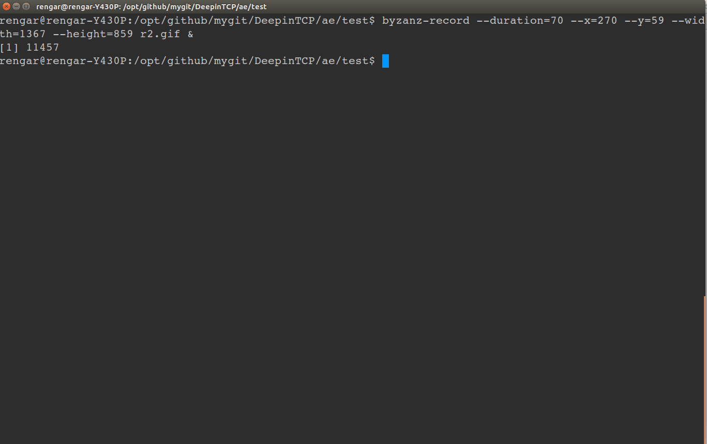

# echo

Implement a **echo** server with TCP.

## Decription

实现了一个echo服务，客户端每向服务器发送字符串，服务器都原封不动回复。原理可参考UNP1-chapter6 。

## Usage

    make
    tty1: ./server
    tty2: ./cli    #cli的标准输入等待用户输入

特殊字符串：
* **:bye**:cli 请求断开server
* **:rc** :cli 请求重连server。仅当当前没有任何连接时才可重连，否则重连失败。

## show

